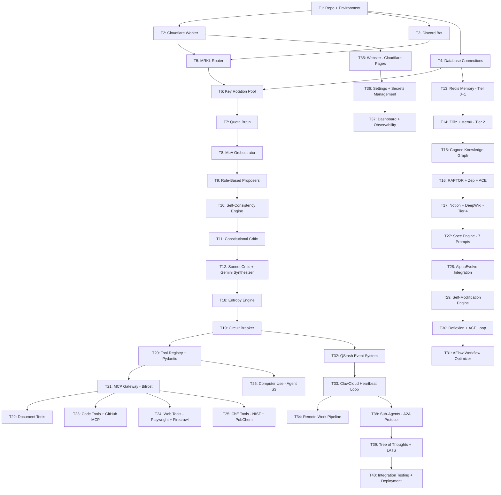

# ULTRON v3 — CORE FLOWS
**References:** Epic Brief v3.0  
**Status:** Complete  
**Coverage:** All 12 primary user and system flows  

---

## Flow Coverage Map

| Flow | Description | Primary Tickets | Key Files |
|---|---|---|---|
| Flow 1 | Ghost sends message → Ultron responds | T1, T2, T3 | cloudflare_worker/index.ts, discord/bot.py |
| Flow 2 | Complex task → Spec Engine → Execution | T4, T5, T6 | spec_engine/, langraph/orchestrator.py |
| Flow 3 | API key exhausted → rotate → continue | T7, T8 | key_rotation/pool.py, quota_brain.py |
| Flow 4 | Memory write → retrieve → use | T9, T10, T11 | memory/, mem0_client.py, zilliz_client.py |
| Flow 5 | MoA pipeline → critique → synthesize | T12, T13 | brain/moa/, brain/critic.py |
| Flow 6 | Tool called → MCP executed → result returned | T14, T15 | tools/, mcp_gateway/ |
| Flow 7 | File created → stored → Ghost downloads | T16, T17 | tools/documents/, fast_io_client.py |
| Flow 8 | Circuit breaker trips → recovery → continue | T18 | circuit_breaker/ |
| Flow 9 | Self-modification → validate → deploy | T19, T20 | self_modification/, alphaevolve/ |
| Flow 10 | Ghost adds API key → pool updates → Ultron scales | T21 | website/settings, cloudflare_kv.py |
| Flow 11 | Remote work loop → idle → self-improve | T22, T23 | heartbeat/, remote_work/ |
| Flow 12 | Computer use → screenshot → click → result | T24, T25 | computer_use/, agent_s3/ |

---

## Flow 1 — Ghost Sends Message → Ultron Responds

### Entry Point
Ghost opens Discord on any device. Types any message in the Ultron DM channel.

### Step-by-Step

| Step | Ghost Action | Ultron Action | Error State |
|---|---|---|---|
| 1 | Types message, hits Enter | Discord sends webhook to Cloudflare Worker | If webhook fails: Discord retries 3x |
| 2 | Waiting | Worker receives message, extracts text and user ID | If user not whitelisted: ignore silently |
| 3 | Waiting | MRKL Router classifies task type (9 categories) | If classification fails: default to COMPLEX |
| 4 | Waiting | Complexity detector decides: Instant vs Deep Mode | — |
| 5a | Waiting (Instant) | Single Gemini 2.5 Pro call + thinking injection | If quota exhausted: rotate key |
| 5b | Waiting (Deep) | Full pipeline activates (see Flow 2) | If pipeline fails: escalate to Opus |
| 6 | Waiting | Response formatted for Discord (max 2000 chars, split if needed) | — |
| 7 | Reads reply | Discord message sent to Ghost | If Discord API down: retry 3x with backoff |

### Exit State
Ghost has received a response. Response stored in memory tier 1 (working). Relevant facts extracted to tier 2 (insight) via Mem0.

### Instant Mode Timing
- Simple question: 5-10 seconds end to end
- Standard response: 8-15 seconds

### Deep Mode Timing  
- Complex task: 3-5 minutes (Ghost not waiting, runs async)
- Result delivered when complete

---

## Flow 2 — Complex Task → Spec Engine → Execution

### Entry Point
MRKL Router classifies task as COMPLEX (entropy score >60 OR multi-component task OR deadline specified).

### Step-by-Step

| Step | System Action | Detail | Error State |
|---|---|---|---|
| 1 | Spec Engine activates | Stored in Redis: task_id, task_description | — |
| 2 | Parallel.ai research | 10 accounts search simultaneously, 8 different angles | If all fail: skip, use training knowledge |
| 3 | Prompt 1: Epic Brief | Gemini 3 Pro generates project Epic Brief | Retry once if quality score <7 |
| 4 | Prompt 2+3 parallel | Core Flows + Tech Plan generated simultaneously | — |
| 5 | Prompt 4: Arch Validation | Claude Opus validates architecture via Puter.js | If Puter.js fails: Gemini Pro fallback |
| 6 | If validation FAILS | Revise Tech Plan, re-validate (max 3 rounds) | If 3 rounds fail: notify Ghost |
| 7 | Prompt 5: Ticket Breakdown | All tickets generated (T1-TN) | — |
| 8 | Prompt 6: Cross-Artifact | Consistency check across all documents | Auto-fix minor inconsistencies |
| 9 | Prompt 7: Ultron Brief | Agent-specific instructions from Ghost's Zilliz memory | — |
| 10 | Store in Notion | All 7 documents saved as Notion pages | If Notion fails: GitHub backup |
| 11 | Notify Ghost | Discord: "Planning complete. [N] tickets. Starting T1." | — |
| 12 | Execute T1 | Read ticket → implement → test → commit → next | See Flow 6 for tool execution |
| 13 | Progress updates | Discord update every completed ticket | — |
| 14 | All tickets done | Final Discord message with deliverable links | — |

### Exit State
All tickets complete. All files committed to GitHub. All deliverables accessible. Full decision log in Notion. Ghost notified.

### Document Generation Timing
- Sequential: 15-20 minutes
- Parallel: 8-10 minutes
- Ghost notified when planning complete before execution begins

---

## Flow 3 — API Key Exhausted → Rotate → Continue

### Entry Point
Any LLM API call receives HTTP 429 (rate limit) OR Quota Brain predicts exhaustion within next 5 calls.

### Step-by-Step

| Step | System Action | Detail | Error State |
|---|---|---|---|
| 1 | 429 received OR prediction triggered | Circuit breaker records the event | — |
| 2 | IMMEDIATE: save checkpoint | Current task state → Redis (key: checkpoint:{task_id}) | If Redis fails: write to local file |
| 3 | Mark key unavailable | Redis: SET key_status:{provider}:{key_id} = "exhausted" EX {reset_seconds} | — |
| 4 | Select next key | Quota Brain: query all keys for this model → filter available → sort by quota → select top | If no keys: cascade to next model tier |
| 5 | Pre-warm selected key | Make test call (tiny prompt) to verify key is working | If fails: select next key |
| 6 | Assemble context passport | Redis checkpoint + Zilliz top-5 memories + current files | All sources parallel |
| 7 | New API call | Same task, new key, full context passport injected | — |
| 8 | Continue from checkpoint | Agent reads passport, understands state, continues | — |
| 9 | Update Quota Brain | Record usage on new key | — |

### Exit State
Task continues seamlessly. No data lost. No task restarted. Total interruption: 55ms for state transfer + provider wait time (avoided by prediction).

### Key Selection Algorithm (O(log n))
```
1. Query Redis: SMEMBERS available_keys:{model}
2. For each key: GET quota_remaining:{key_id}
3. Sort by quota_remaining descending (sorted set = O(log n))
4. Return top key
5. Background: pre-warm key at position 2
```

---

## Flow 4 — Memory Write → Retrieve → Use

### Write Flow (after every agent action)

| Step | Action | Storage Target | Latency |
|---|---|---|---|
| 1 | Agent completes action | — | — |
| 2 | Mem0 extracts atomic facts | Zilliz (insight tier) | async, <100ms |
| 3 | Cognee updates knowledge graph | Cognee graph store | async, <200ms |
| 4 | Core memory self-edit check | "Is this important enough for always-in-context?" | sync, <50ms |
| 5 | Append to JSONL archive | GitHub /memory/archive.jsonl | async, <500ms |
| 6 | ACE curator check | "Is this a new lesson? Add to playbook?" | async, <300ms |
| 7 | Zep temporal update | Tag with episode_id + timestamp | async, <100ms |

### Retrieve Flow (before every task)

| Step | Action | Source | Latency |
|---|---|---|---|
| 1 | Core memory loaded | Redis (always present) | <5ms |
| 2 | Semantic search | Zilliz top-10 relevant facts | <50ms |
| 3 | Graph traversal | Cognee: related entities | <100ms |
| 4 | RAPTOR level select | Broad query → Level 2-3 / Specific → Level 0-1 | <50ms |
| 5 | Temporal query | Zep: relevant episode context | <80ms |
| 6 | ACE playbook load | Lessons for this task type | <30ms |
| 7 | Hallucination check | Does task require lossless archive? If so: fetch | <500ms |
| 8 | Passport assembled | All sources combined | Total: <200ms normal |

### Exit State
Every agent call has exactly the right context. No noise. No missing information. Retrieval time stays constant regardless of how much memory exists (RAPTOR tree).

---

## Flow 5 — MoA Pipeline → Critique → Synthesize

### Entry Point
Task classified as requiring Deep Mode. Research phase complete. Ready for agent swarm.

### Step-by-Step

| Step | Action | Models Used | Parallel? | Time |
|---|---|---|---|---|
| 1 | Task complexity scored | Entropy engine | No | 1s |
| 2 | Thinking depth selected | CoT / ToT / GoT / LATS | No | 1s |
| 3 | Parallel.ai research injected | 10 accounts | Yes | 60-90s |
| 4 | 8 proposers fire | All roles simultaneously | YES (all 8) | 25-35s |
| 5 | Self-consistency check | 5 models on key questions | Yes (5) | 20-30s |
| 6 | PRM step scoring | Gemini Flash scores each step | No | 10s |
| 7 | Sonnet 4.6 Critic | Reads all 8 proposals | No | 10-15s |
| 8 | Constitutional Critic ×3 | Round 1: find flaws / Round 2: verify / Round 3: fixes | No | 30s |
| 9 | Confidence check | "How confident 0-100?" | No | 5s |
| 10 | Entropy gate | >85 → Opus / <85 → proceed | No | 2s |
| 10a | Opus gate (if triggered) | Claude Opus 4.6 via Puter.js | No | 15-20s |
| 11 | Gemini 3 Pro synthesis | Reads everything, builds answer | No | 15-20s |
| 12 | LATS simulation (if algorithmic) | Simulate before implementing | Yes | 30-60s |
| 13 | AlphaEvolve (if optimization) | Evolve over generations | Async | 5-20min |

### Role Assignments (8 Proposers)

| Role | Model | Temperature | Prompt Focus |
|---|---|---|---|
| Architect | Gemini 2.5 Pro | 0.3 | Structure, scalability, long-term |
| Engineer | DeepSeek Coder V3 via Groq | 0.4 | Implementation, libraries, simplicity |
| QA Breaker | Gemini 2.5 Pro (instance 2) | 0.7 | How to break this, edge cases |
| Researcher | Grok 4.1 (2M context) | 0.4 | Latest research, state of art |
| Reasoner | DeepSeek R1 via Puter.js | 0.2 | Logic, math, proof chains |
| Devil's Advocate | Llama 4 Maverick | 0.8 | Why this is wrong, opposite view |
| Domain Expert | Gemini Student Pro | 0.3 | ChE domain, Ghost's domain context |
| Validator | Cerebras Llama 70B | 0.2 | Fast sanity check, obvious errors |

### Exit State
Synthesized answer ready. Confidence score attached. All intermediate proposals stored in Zilliz for future reference. Quality score from 3-layer judge attached before delivery.

---

## Flow 6 — Tool Called → MCP Executed → Result Returned

### Entry Point
Agent decides to use a tool from the registry. Tool name and parameters passed to Tool Dispatcher.

### Step-by-Step

| Step | Action | Detail | Error State |
|---|---|---|---|
| 1 | Tool request received | {tool_name, parameters, task_id} | — |
| 2 | Permission check | Permission matrix: READ/WRITE/DELETE/DEPLOY | If forbidden: return error to agent |
| 3 | Pydantic validation | Strict schema validation, extra='forbid' | If invalid: return schema error |
| 4 | Dry run (if destructive) | Preview what will happen before doing it | If preview fails: abort |
| 5 | Bifrost MCP Gateway | Route to correct MCP server | If server down: fallback or queue |
| 6 | MCP server executes | Tool runs in appropriate environment | If fails: retry once with backoff |
| 7 | E2B sandbox (if code) | Isolated execution, destroyed after | If container fails: GitHub Actions fallback |
| 8 | Result returned | Structured JSON result | — |
| 9 | Observability log | JSONL event log: tool, params hash, result hash, duration | Always |
| 10 | Circuit breaker update | Record this action, check for loop patterns | If loop detected: halt |
| 11 | Memory update | Store relevant facts from tool result | Async |

### Tool Permission Matrix

| Tool Category | Permission Level | Approval Required |
|---|---|---|
| read_file, search_*, get_* | READ — Always allowed | None |
| write_code, create_*, update_* | WRITE — After entropy check | Auto |
| commit_github, create_pr | WRITE — Always allowed | None |
| delete_file, delete_* | DELETE — Always | Ghost Discord confirm |
| deploy_*, publish_* | DEPLOY — Always | Ghost Discord confirm |
| delete_repo, delete_account | NEVER | Cannot be called |

### Exit State
Tool result returned to agent. Logged to JSONL. Memory updated. Circuit breaker updated. Agent continues reasoning.

---

## Flow 7 — File Created → Stored → Ghost Downloads

### Entry Point
Agent needs to create a deliverable file (PDF, Word, Excel, PowerPoint, LaTeX, code file, website).

### Step-by-Step

| Step | Action | Tool Used | Output |
|---|---|---|---|
| 1 | Agent generates content | MoA pipeline | Text/code content |
| 2 | File creation tool called | create_pdf / create_word / create_excel / create_pptx / create_latex | Raw file |
| 3 | Quality check | AI judge reviews content | Pass/fail |
| 4 | If fail: revise | Constitutional critic on content | Revised content |
| 5 | File saved to Fast.io | fast_io_client.save(file, metadata) | Permanent cloud URL |
| 6 | File saved to GitHub | /outputs/{project}/{timestamp}/{filename} | GitHub URL |
| 7 | Discord notification | "File ready: [filename] [Fast.io link] [GitHub link]" | Ghost receives |
| 8 | Notion update | Add file to project log | Notion page updated |

### LaTeX Special Flow
```
1. Generate .tex content
2. Install texlive (if not present on ClawCloud)
3. pdflatex compile (×2 for references)
4. Check for compilation errors
5. If errors: auto-fix common LaTeX errors
6. Retry compilation
7. If still fails: generate simplified version without problematic elements
8. Save PDF to Fast.io + GitHub
```

### Exit State
Ghost has permanent download links in Discord and Notion. File exists in Fast.io (50GB cloud, never deleted) and GitHub (version controlled, permanent).

---

## Flow 8 — Circuit Breaker Trips → Recovery → Continue

### Entry Point
One of 3 detectors fires:
- Semantic Hash Ring: same action fingerprint 3+ times in window
- Progress Entropy Detector: tokens consumed without quality improvement
- State Diff Monitor: git diff shows no changes despite many actions

### Step-by-Step

| Step | Action | Detail | Timing |
|---|---|---|---|
| 1 | Detector fires | Which of 3 detectors triggered | Immediate |
| 2 | State saved | Current task state → Redis checkpoint | <100ms |
| 3 | Circuit opens | State = OPEN. This agent's actions: HALTED | Immediate |
| 4 | Trip count check | Is this attempt 1 or 2? | — |
| 5a | Trip 1-2: Auto-recover | Call Claude Opus via Puter.js: "I'm stuck. Different approach?" | 15-20s |
| 5b | Trip 3+: Escalate | Discord to Ghost: full context, what was tried, options | Immediate |
| 6 | Auto-recover: new approach | Opus suggests completely different direction | — |
| 7 | Clear action history | Semantic ring cleared (breaks the loop pattern) | — |
| 8 | Circuit half-opens | State = HALF_OPEN. Try one action. | — |
| 9 | If successful | Circuit closes. State = CLOSED. Continue normally. | — |
| 10 | If fails again | Back to OPEN. Escalate to Ghost. | — |
| 11 | Timeout (10min HALF_OPEN) | If not resolved → OPEN → Ghost alert | — |

### Ghost Escalation Message Format
```
🔴 Ultron Circuit Breaker

Task: [mission]
Stuck on: [specific action]
Attempts: [N]
Tokens wasted: [N]

What I tried:
1. [approach 1] → [result]
2. [approach 2] → [result]

What I need from you:
Reply RETRY / SKIP / ABORT / [new instructions]
```

### Exit State
Either task continues with new approach OR Ghost provides input. Task is never permanently stuck. Agent never loops forever.

---

## Flow 9 — Self-Modification → Validate → Deploy

### Entry Point
Ultron is idle (no Ghost tasks for >30 minutes) OR entropy scan identifies a weak component.

### Step-by-Step

| Step | Action | Constraint | Error State |
|---|---|---|---|
| 1 | Identify target | Entropy scan of own codebase → weakest component | Only from WHITELIST |
| 2 | Whitelist check | /tools/* /prompts/task_specific/* /config/model_routing.json | If not in whitelist: STOP |
| 3 | MoA generates proposals | 3 improvement proposals for the component | — |
| 4 | AlphaEvolve rounds | Generate → evaluate → select → crossover (10 generations) | — |
| 5 | Create branch | git checkout -b self-mod/{timestamp} | — |
| 6 | Implement improvement | Write the improved code | — |
| 7 | Run tests | pytest / jest → must be 100% pass | If <100%: discard branch |
| 8 | Mutation testing | Introduce bugs → verify tests catch them | If tests miss mutations: discard |
| 9 | Canary deployment | Deploy to canary branch, run 1 hour on real tasks | — |
| 10 | Canary evaluation | Error rate comparison: canary vs main | If error rate higher: discard |
| 11 | Merge to main | git merge, redeploy on ClawCloud | — |
| 12 | Log decision | Zilliz + Notion: what changed, why, performance delta | — |

### Sacred Files (NEVER self-modified)
```
/core/session.py           ← context restoration
/core/memory/restore.py    ← passport assembly
/core/key_rotation/pool.py ← rotation core
/core/watchdog.py          ← self-healing
/core/circuit_breaker.py   ← loop prevention
/core/security/            ← permission matrix
/prompts/system/           ← personality + soul
```

### Exit State
Ultron is measurably better at the target component. Performance metrics tracked before/after. Full audit trail in Notion. If anything went wrong: automatic rollback, original behavior preserved.

---

## Flow 10 — Ghost Adds API Key → Pool Updates → Ultron Scales

### Entry Point
Ghost opens Ultron website on any device. Navigates to Settings tab.

### Step-by-Step

| Step | Ghost Action | System Action | Result |
|---|---|---|---|
| 1 | Opens Settings tab | Website loads current key status | Ghost sees all providers |
| 2 | Clicks "Add Gemini Key" | Input field appears | — |
| 3 | Pastes API key, clicks Save | Website sends encrypted to Cloudflare Worker | — |
| 4 | Worker validates key | Makes test call to Gemini API | If invalid: error shown |
| 5 | If valid | Stored in Cloudflare KV (encrypted) | — |
| 6 | Quota Brain notified | Reads new key, adds to pool | <1 second |
| 7 | Pool updated | New quota available immediately | — |
| 8 | Auto-scaling | Quota Brain recalculates optimal MoA depth | — |
| 9 | Dashboard updates | Ghost sees: "Gemini keys: 11. Daily capacity: +1000 req" | — |
| 10 | Ghost closes website | Done forever. Ultron uses new key automatically. | — |

### Auto-Scaling Thresholds

| Total Quota Available | MoA Depth | Self-Consistency | Research | ConstitutionalRounds |
|---|---|---|---|---|
| >20,000 req/day | 8 proposers | ×10 | All tasks | 3 |
| 10,000-20,000 | 8 proposers | ×5 | Complex only | 2 |
| 5,000-10,000 | 5 proposers | ×3 | Off | 1 |
| <5,000 | 1 proposer | ×1 | Off | 0 |

### Exit State
Ghost did zero technical work. Ultron is more capable. No code changes. No redeployment.

---

## Flow 11 — Remote Work Loop → Idle → Self-Improve

### Entry Point
Ghost gives long-running task: "Build [project] over [timeline]. Improve it continuously."

### Active Work Phase

```
EVERY 30 SECONDS (heartbeat):
1. Read task queue from Redis
2. Get highest-entropy task (priority)
3. Execute one atomic action
4. Commit if code changed
5. Update memory with learnings
6. Check circuit breaker
7. Send progress if milestone hit
8. Sleep 30 seconds
9. Repeat
```

### Idle Phase (no Ghost tasks)

```
WHEN TASK QUEUE EMPTY:
1. Detect: "I have free time"
2. Switch to self-improvement mode
3. AlphaEvolve on weakest component
4. Research ArXiv for relevant papers
5. Apply promising findings
6. Update skills library
7. Update ACE playbook with lessons
8. Commit all improvements
9. Wait for next Ghost task
```

### Remote Work for Ghost's Project

```
DAY 1-7: Build foundation (from spec tickets)
DAY 8-30: Implement core features
DAY 31-60: Add advanced features (researched from ArXiv)
DAY 61-85: Self-improve the project code
DAY 86-100: Polish, test, document, deploy

THROUGHOUT:
- Every improvement commits to GitHub
- Notion updated with decisions
- Discord updates at milestones
- Ghost never has to supervise
- Ghost can check anytime
```

### Exit State
After 100 days: production-grade project delivered. Ghost effort: <20 hours total. Ultron effort: 24 hours × 100 days = 2,400 hours equivalent.

---

## Flow 12 — Computer Use → Screenshot → Click → Result

### Entry Point
Agent decides task requires GUI interaction (software with no API, specific website, desktop application).

### Step-by-Step

| Step | Action | Tool | Error State |
|---|---|---|---|
| 1 | Computer use triggered | Route to ClawCloud Instance 3 (GPU instance) | If Instance 3 unavailable: queue task |
| 2 | Start virtual display | Xvfb :99 -screen 0 1920x1080x24 | If fails: restart container |
| 3 | Open target application | agent_s3.open_app(app_name) OR browser_url | If app not installed: apt-get install |
| 4 | Take screenshot | agent_s3.screenshot() → PNG → Gemini Vision | — |
| 5 | Understand screen | Gemini 2.5 Pro: "What is on this screen? What can I do?" | — |
| 6 | Plan actions | LATS: simulate what sequence of clicks achieves goal | — |
| 7 | Ground actions | UI-TARS-1.5-7B: "Where exactly is [button]?" → pixel coords | — |
| 8 | Execute action | agent_s3.click(x, y) OR agent_s3.type(text) | — |
| 9 | New screenshot | Verify action had intended effect | If not: retry with different approach |
| 10 | Repeat | Until task complete | Max 50 iterations before escalation |
| 11 | Extract result | Read screen output, extract data | — |
| 12 | Return to agent | Structured result sent back | — |

### ChE-Specific Computer Use Examples
```
HYSYS simulation:
1. Open HYSYS (installed on ClawCloud)
2. Navigate to: New Case → Flash Calculation
3. Enter: Temperature, Pressure, Composition
4. Click: Run
5. Screenshot results panel
6. Gemini Vision reads: K-values, phase compositions
7. Returns structured data to agent

ASPEN Plus:
1. Open ASPEN → New simulation
2. Add unit operations via drag-and-drop
3. Enter stream data via keyboard
4. Run simulation
5. Extract results from report
```

### Exit State
Task that required GUI completed without any API. Result returned as structured data. Screenshot history stored for audit. Agent continues with extracted data.

---

## Implementation Sequence (Dependency Graph)



---

## Complete File Checklist

| File | Action | Flow(s) |
|---|---|---|
| cloudflare_worker/index.ts | Create | 1 |
| cloudflare_worker/router.ts | Create | 1 |
| cloudflare_worker/kv_client.ts | Create | 10 |
| discord/bot.py | Create | 1 |
| discord/message_handler.py | Create | 1 |
| discord/formatter.py | Create | 1 |
| brain/mrkl_router.py | Create | 1, 2 |
| brain/complexity_detector.py | Create | 1, 2 |
| brain/moa/orchestrator.py | Create | 5 |
| brain/moa/proposers.py | Create | 5 |
| brain/moa/roles.py | Create | 5 |
| brain/critic.py | Create | 5 |
| brain/constitutional_critic.py | Create | 5 |
| brain/synthesizer.py | Create | 5 |
| brain/self_consistency.py | Create | 5 |
| brain/prm_scorer.py | Create | 5 |
| brain/confidence_checker.py | Create | 5 |
| brain/thinking/tree_of_thoughts.py | Create | 5 |
| brain/thinking/graph_of_thoughts.py | Create | 5 |
| brain/thinking/lats.py | Create | 5 |
| key_rotation/pool.py | Create | 3 |
| key_rotation/quota_brain.py | Create | 3, 10 |
| key_rotation/admission_control.py | Create | 3 |
| memory/core_memory.py | Create | 4 |
| memory/working_memory.py | Create | 4 |
| memory/passport.py | Create | 3, 4 |
| memory/mem0_client.py | Create | 4 |
| memory/zilliz_client.py | Create | 4 |
| memory/cognee_client.py | Create | 4 |
| memory/raptor.py | Create | 4 |
| memory/zep_client.py | Create | 4 |
| memory/ace_loop.py | Create | 4, 9 |
| memory/pruning.py | Create | 4 |
| memory/backup.py | Create | 4 |
| tools/registry.py | Create | 6 |
| tools/dispatcher.py | Create | 6 |
| tools/permissions.py | Create | 6 |
| tools/documents/pdf.py | Create | 7 |
| tools/documents/word.py | Create | 7 |
| tools/documents/excel.py | Create | 7 |
| tools/documents/pptx.py | Create | 7 |
| tools/documents/latex.py | Create | 7 |
| tools/code/writer.py | Create | 6 |
| tools/code/runner.py | Create | 6 |
| tools/code/tester.py | Create | 6 |
| tools/che/mass_balance.py | Create | 6 |
| tools/che/thermo.py | Create | 6 |
| tools/che/distillation.py | Create | 6 |
| tools/che/unit_convert.py | Create | 6 |
| mcp_gateway/bifrost_client.py | Create | 6 |
| mcp_gateway/servers.py | Create | 6 |
| mcp_gateway/health_monitor.py | Create | 6 |
| computer_use/agent_s3.py | Create | 12 |
| computer_use/vision.py | Create | 12 |
| computer_use/ui_tars.py | Create | 12 |
| computer_use/xvfb_manager.py | Create | 12 |
| circuit_breaker/breaker.py | Create | 8 |
| circuit_breaker/semantic_hash.py | Create | 8 |
| circuit_breaker/entropy_detector.py | Create | 8 |
| circuit_breaker/state_diff.py | Create | 8 |
| circuit_breaker/budget_guardian.py | Create | 8 |
| entropy_engine/engine.py | Create | 2, 9, 11 |
| entropy_engine/memory_entropy.py | Create | 4 |
| entropy_engine/codebase_entropy.py | Create | 9 |
| entropy_engine/task_entropy.py | Create | 2, 11 |
| entropy_engine/bug_entropy.py | Create | 11 |
| self_modification/engine.py | Create | 9 |
| self_modification/whitelist.py | Create | 9 |
| self_modification/canary.py | Create | 9 |
| alphaevolve/evolver.py | Create | 9 |
| alphaevolve/evaluator.py | Create | 9 |
| alphaevolve/crossover.py | Create | 9 |
| spec_engine/generator.py | Create | 2 |
| spec_engine/prompts/ | Create | 2 |
| spec_engine/validator.py | Create | 2 |
| heartbeat/loop.py | Create | 11 |
| heartbeat/scheduler.py | Create | 11 |
| remote_work/pipeline.py | Create | 11 |
| sub_agents/orchestrator.py | Create | 5 |
| sub_agents/a2a_protocol.py | Create | 5 |
| observability/event_log.py | Create | 6 |
| observability/metrics.py | Create | all |
| website/src/ | Create | 10 |
| website/src/settings.tsx | Create | 10 |
| website/src/dashboard.tsx | Create | all |
| website/src/chat.tsx | Create | 1 |
| infrastructure/docker-compose.yml | Create | all |
| infrastructure/cloudflare.toml | Create | all |
| infrastructure/.env.example | Create | all |
