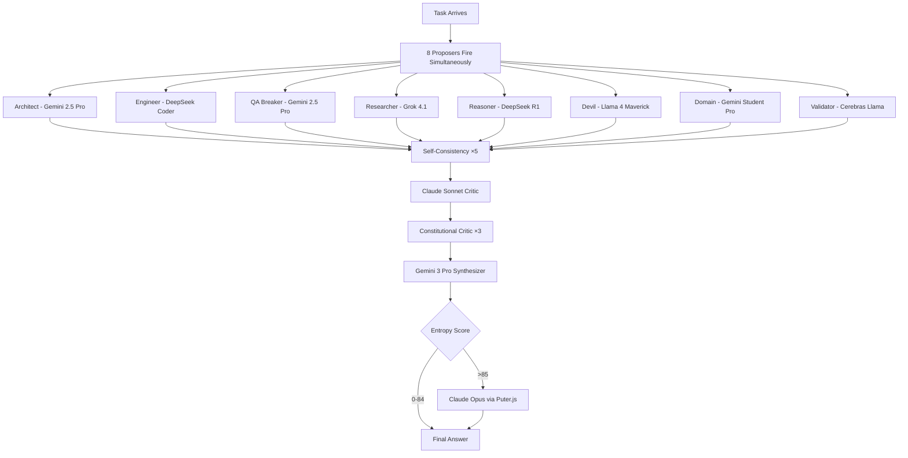
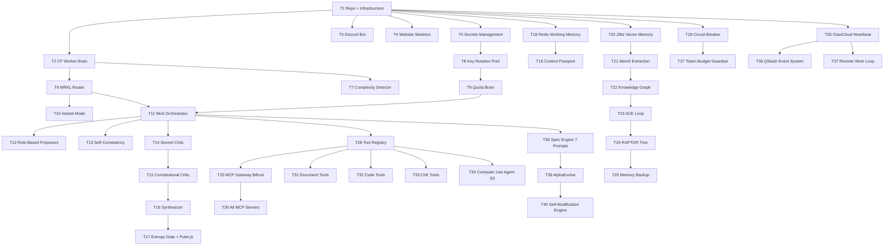

# ULTRON v3 — CORE FLOWS
**References:** Epic Brief v3.0  
**Date:** March 2026

---

## Flow Coverage Map

| Flow | Description | Primary Tickets | Key Files |
|---|---|---|---|
| Flow 1 | Ghost sends message → Ultron responds | T6, T7, T8 | cloudflare_worker/index.ts, brain/mrkl_router.py |
| Flow 2 | Simple conversational response | T8, T9 | brain/instant_mode.py |
| Flow 3 | Complex task → Epic Flow planning | T10, T11, T12 | brain/spec_engine/, brain/epic_flow.py |
| Flow 4 | MoA deep reasoning | T13, T14, T15 | brain/moa_orchestrator.py |
| Flow 5 | Key rotation on exhaustion | T16, T17 | brain/key_rotation/pool.py |
| Flow 6 | Memory write (new information) | T18, T19, T20 | memory/mem0_extractor.py |
| Flow 7 | Memory read (context retrieval) | T21, T22 | memory/retrieval_engine.py |
| Flow 8 | Tool execution | T23, T24, T25 | tools/registry.py, tools/executor.py |
| Flow 9 | Circuit breaker activation | T26 | brain/circuit_breaker.py |
| Flow 10 | Self-modification cycle | T34, T35 | self_mod/alphaevolve.py |
| Flow 11 | Remote work perpetual loop | T36, T37 | execution/heartbeat.py |
| Flow 12 | Secrets management via website | T4, T5 | website/settings.py |
| Flow 13 | Computer use task | T28, T29 | tools/computer_use/ |
| Flow 14 | Key exhaustion → rotation | T16, T17 | brain/quota_brain.py |

---

## Flow 1 — Ghost Sends Message → Ultron Responds

### Entry Point
Ghost opens Discord on any device. Types any message in Ultron's DM channel.

### Step-by-Step

| Step | Ghost Action | Ultron System Response | Error State |
|---|---|---|---|
| 1 | Types message, presses send | Discord delivers to Ultron bot webhook | Discord API down: retry 3× then log |
| 2 | — | Cloudflare Worker receives webhook payload | Worker crash: QStash retries automatically |
| 3 | — | Complexity Detector classifies message | Classification fail: default to COMPLEX mode |
| 4 | — | If CONVERSATIONAL: Instant Mode activates | — |
| 4b | — | If TASK: Deep Mode + Epic Flow activates | — |
| 5 | — | Context Passport assembled from Redis | Redis down: rebuild from Zilliz (100ms) |
| 6 | — | Response generated (8-12s or 2-3min) | Timeout: partial response + "continuing..." |
| 7 | — | Discord message sent to Ghost | Discord rate limit: queue and retry |

### Exit State
Ghost has received a response. Task is either answered or queued for execution. All interaction logged to Zilliz + JSONL.

### Key Files
```
cloudflare_worker/src/index.ts         ← receives Discord webhook
cloudflare_worker/src/intent_parser.ts ← complexity detection
brain/instant_mode.py                  ← single model fast response
brain/epic_flow.py                     ← full MoA pipeline
memory/passport.py                     ← context passport assembly
interface/discord_sender.py            ← sends response back
```

---

## Flow 2 — Simple Conversational Response (Instant Mode)

### Entry Point
Complexity Detector classifies message as CONVERSATIONAL. Examples: "what is activation energy", "who invented Python", "what time is it in Tokyo"

### Step-by-Step

| Step | Action | System Response | Error |
|---|---|---|---|
| 1 | CONVERSATIONAL detected | Instant Mode activates | — |
| 2 | — | Load Core Memory from Redis (always loaded) | Redis miss: load from Zilliz |
| 3 | — | Thinking injection prompt applied | — |
| 4 | — | Single Gemini 2.5 Pro call | Key exhausted: rotate to next key |
| 5 | — | PRM scores the response | Score < 0.7: regenerate once |
| 6 | — | Response sent to Discord | — |

### Timing
Total: 8-12 seconds. Ghost experiences as near-instant.

### Key Files
```
brain/instant_mode.py
brain/thinking_injector.py
brain/prm_scorer.py
brain/key_rotation/pool.py
```

---

## Flow 3 — Complex Task → Epic Flow Planning + Spec Engine

### Entry Point
Complexity Detector classifies message as COMPLEX or TASK. Examples: "build me a website", "create a lab report", "write a Python script that does X"

### Step-by-Step

| Step | Action | System Response | Error |
|---|---|---|---|
| 1 | COMPLEX/TASK detected | Epic Flow activates | — |
| 2 | — | Parallel.ai ×10 accounts fire simultaneously researching task domain | API fail: skip research, continue with training knowledge |
| 3 | — | Spec Engine runs (for complex multi-day projects) | — |
| 3a | — | Prompt 1: Epic Brief generated (Gemini 3 Pro) | — |
| 3b | — | Prompt 2+3: Core Flows + Tech Plan (parallel) | — |
| 3c | — | Prompt 4: Architecture Validation (Claude Opus) | — |
| 3d | — | Prompt 5: Ticket Breakdown | — |
| 3e | — | Prompt 6+7: Cross-Artifact + Ultron Brief | — |
| 4 | — | All spec docs stored in Notion + Zilliz | — |
| 5 | — | Ghost notified: "Specs ready. Review here: [Notion link]. Executing in 5 min unless you say stop." | — |
| 6 | — | Execution begins from Ticket T1 | — |
| 7 | — | Progress updates every milestone to Discord | — |

### For Simple Tasks (not multi-day projects)
Steps 3a-3e skipped. Direct to MoA execution.

### Timing
Spec generation: 8-10 minutes (parallel).
Ghost review window: 5 minutes.
Total before execution: 13-15 minutes.

### Key Files
```
brain/complexity_detector.py
brain/spec_engine/epic_brief_prompt.py
brain/spec_engine/core_flows_prompt.py
brain/spec_engine/tech_plan_prompt.py
brain/spec_engine/arch_validation_prompt.py
brain/spec_engine/ticket_breakdown_prompt.py
brain/spec_engine/cross_artifact_prompt.py
brain/spec_engine/ultron_brief_prompt.py
brain/spec_engine/orchestrator.py
interface/notion_writer.py
```

---

## Flow 4 — MoA Deep Reasoning (8 Role-Based Proposers)

### Entry Point
Any task requiring deep mode reasoning. Called by Epic Flow for each decision point.

### Step-by-Step

| Step | Action | System Response | Error |
|---|---|---|---|
| 1 | Task arrives at MoA | Role assignment begins | — |
| 2 | — | 8 proposers fire simultaneously (parallel): Architect, Engineer, QA Breaker, Researcher, Reasoner, Devil's Advocate, Domain Expert, Fast Validator | Any proposer fails: circuit breaker catches, retry with different key |
| 3 | — | Each proposer reads: task + Parallel.ai research + context passport + role-specific system prompt + relevant skill from Skills Library | — |
| 4 | — | Self-consistency check: 3 key questions asked to 5 different models | <3/5 agree: escalate to Opus gate |
| 5 | — | Claude Sonnet 4.6 critic reads all 8 proposals | — |
| 6 | — | Constitutional critic (3 rounds): find flaws → verify flaws → confirm fixes | — |
| 7 | — | Gemini 3 Pro synthesizer builds final answer | — |
| 8 | — | Entropy gate: score >85 → Claude Opus via Puter.js | Score 0-84: proceed directly |
| 9 | — | Tree of Thoughts activated for complex architecture decisions | — |
| 10 | — | Final answer returned to caller | — |

### Timing
Without Opus: 2-3 minutes.
With Opus: 3-4 minutes.
Ghost is not watching during this time.

### Mermaid Diagram


### Key Files
```
brain/moa_orchestrator.py
brain/proposers/architect.py
brain/proposers/engineer.py
brain/proposers/qa_breaker.py
brain/proposers/researcher.py
brain/proposers/reasoner.py
brain/proposers/devils_advocate.py
brain/proposers/domain_expert.py
brain/proposers/fast_validator.py
brain/self_consistency.py
brain/critics/sonnet_critic.py
brain/critics/constitutional_critic.py
brain/synthesizer.py
brain/entropy_gate.py
brain/puter_opus_caller.py
```

---

## Flow 5 — Key Exhaustion → Rotation (Zero Friction)

### Entry Point
Any API call returns HTTP 429 (rate limit) OR Quota Brain predicts exhaustion within 5 calls.

### Step-by-Step

| Step | Action | System Response | Error |
|---|---|---|---|
| 1 | 429 received OR quota predicted low | Circuit breaker saves checkpoint to Redis | Redis fail: save to local file |
| 2 | — | Exhausted key marked unavailable until reset time | — |
| 3 | — | Quota Brain selects next available key (O(log n)) | No keys available: emergency fallback to Gemini Flash |
| 4 | — | Context passport assembled (Redis + Zilliz) | — |
| 5 | — | New API call fires with full context | — |
| 6 | — | Task continues exactly from checkpoint | — |

### Timing
Total: 55ms from 429 to continuation. Invisible to Ghost.

### Key Files
```
brain/key_rotation/pool.py
brain/key_rotation/quota_brain.py
brain/key_rotation/admission_control.py
memory/passport.py
```

---

## Flow 6 — Memory Write (New Information Stored)

### Entry Point
Ultron learns something new: Ghost mentions a person, a preference, a fact, a decision. OR Ultron completes a task and stores the result.

### Step-by-Step

| Step | Action | System Response | Error |
|---|---|---|---|
| 1 | New information detected | Memory write pipeline activates | — |
| 2 | — | Mem0 extracts atomic facts from text | Extraction fail: store raw text as fallback |
| 3 | — | Duplicate check (cosine similarity >0.95 = skip) | — |
| 4 | — | Atomic facts written to Zilliz with metadata | Zilliz fail: write to Upstash Redis queue |
| 5 | — | Knowledge graph updated (entity relationships) via Cognee | Graph fail: log for retry |
| 6 | — | ACE Curator checks: is this a new lesson? | — |
| 7 | — | If lesson: add to Playbook in Notion | — |
| 8 | — | JSONL entry appended to GitHub (lossless archive) | — |
| 9 | — | Core Memory self-edits if high importance fact | — |

### Timing
Full write: 200-500ms (async, doesn't block task execution).

### Key Files
```
memory/mem0_extractor.py
memory/zilliz_client.py
memory/knowledge_graph.py
memory/ace_curator.py
memory/core_memory.py
memory/jsonl_archive.py
```

---

## Flow 7 — Memory Read (Context Retrieval)

### Entry Point
Any task begins. Ultron needs relevant context before acting.

### Step-by-Step

| Step | Action | System Response | Error |
|---|---|---|---|
| 1 | Task arrives | Memory retrieval pipeline starts | — |
| 2 | — | Core Memory loaded (always in Redis, instant) | — |
| 3 | — | Mem0 semantic search: top-10 relevant atomic facts | Zilliz down: use Redis cache |
| 4 | — | Knowledge graph traversal: related entities | Cognee fail: skip graph, use vector only |
| 5 | — | RAPTOR: correct summary level for query type | — |
| 6 | — | Zep temporal: relevant episode context | — |
| 7 | — | ACE Playbook: lessons for this task type | — |
| 8 | — | Lossless archive: ONLY if hallucination risk detected | — |
| 9 | — | Context passport assembled (all above combined) | — |
| 10 | — | Passport injected into every model call | — |

### Timing
Full retrieval: 50-100ms. Feels instant.

---

## Flow 8 — Tool Execution

### Entry Point
Brain decides a tool must be called. MRKL Router selects appropriate tool from registry.

### Step-by-Step

| Step | Action | System Response | Error |
|---|---|---|---|
| 1 | Tool selected by MRKL Router | Tool executor receives request | — |
| 2 | — | Pydantic schema validates input (strict mode) | Invalid input: return schema error, don't execute |
| 3 | — | Permission matrix check | DELETE/DEPLOY: require Discord confirmation from Ghost |
| 4 | — | Tool executes in appropriate environment | Tool crash: circuit breaker catches, retry ×3 |
| 5 | — | Output validated (expected structure) | Unexpected output: log + flag for review |
| 6 | — | Result returned to Brain | — |
| 7 | — | JSONL event logged (tool name, input hash, output hash, duration) | — |

### Tool Permission Matrix
| Permission Level | Tools | Approval Needed |
|---|---|---|
| ALWAYS_ALLOWED | read_file, search_web, memory_read, send_discord | None |
| ENTROPY_CHECKED | write_code, create_document, commit_github | Entropy score < 70 |
| GHOST_CONFIRM | delete_file, deploy, delete_repo | Discord confirmation |
| NEVER | delete_account, billing_access | Hardcoded off |

### Key Files
```
tools/registry.py
tools/executor.py
tools/permission_matrix.py
tools/validators/ (one per tool)
```

---

## Flow 9 — Circuit Breaker Activation

### Entry Point
Semantic hash detects repeated action (3+ times same pattern) OR Progress entropy (tokens growing, no output quality improvement) OR State diff shows world not changing.

### Step-by-Step

| Step | Action | System Response | Error |
|---|---|---|---|
| 1 | Loop detected by any of 3 layers | Circuit breaker trips to OPEN state | — |
| 2 | — | Current state saved to Redis (checkpoint) | — |
| 3 | — | trip_count incremented | — |
| 4 | — | If trip_count ≤ 2: Auto-recovery | — |
| 4a | — | Action history cleared | — |
| 4b | — | Claude Opus called: "suggest completely different approach" | — |
| 4c | — | New approach injected into task queue | — |
| 4d | — | Circuit moves to HALF_OPEN (10 minute timeout) | — |
| 5 | — | If trip_count > 2: Escalate to Ghost | — |
| 5a | — | Discord message: "I'm stuck. Here's what I tried. What should I do?" | — |
| 5b | — | Options: RETRY, SKIP, ABORT, or new instructions | — |
| 5c | — | System halts until Ghost responds | — |

### Key Files
```
brain/circuit_breaker.py
brain/circuit_breaker/semantic_hash_ring.py
brain/circuit_breaker/progress_entropy_detector.py
brain/circuit_breaker/state_diff_monitor.py
brain/circuit_breaker/token_budget_guardian.py
```

---

## Flow 10 — Self-Modification Cycle

### Entry Point
Ultron detects idle time (no Ghost tasks queued) OR AlphaEvolve is triggered by algorithm optimization need.

### Step-by-Step (AlphaEvolve Style)

| Step | Action | System Response | Error |
|---|---|---|---|
| 1 | Idle detected | Self-modification engine activates | — |
| 2 | — | Entropy scan of Ultron's own codebase | — |
| 3 | — | Weakest component identified (highest entropy) | — |
| 4 | — | Check whitelist: is this file allowed to be modified? | File in FORBIDDEN list: skip, try next |
| 5 | — | AlphaEvolve Generation 1: 10 variants (Gemini Flash) | — |
| 6 | — | Evaluation: test suite + entropy score + performance | — |
| 7 | — | Top 3 variants selected | — |
| 8 | — | AlphaEvolve Crossover: Gemini Pro combines top 3 | — |
| 9 | — | 5 hybrid variants generated and evaluated | — |
| 10 | — | Best hybrid selected | — |
| 11 | — | Deployed to canary branch | — |
| 12 | — | 1 hour live test on real tasks | — |
| 13 | — | If error rate stable: merge to main, redeploy | — |
| 13b | — | If error rate rises: auto-rollback, log failure | — |
| 14 | — | Decision logged to Zilliz + Notion | — |

### Whitelist (ONLY these files can be self-modified)
```
/tools/*                          → add new tools
/prompts/task_specific/*          → task prompts
/config/model_routing.json        → model selection
/skills/generated/*               → auto-generated skills
/brain/proposers/prompts/*        → proposer role prompts
```

### Permanently Forbidden (hardcoded)
```
/brain/core/session.py            → context restoration
/memory/restore.py                → passport assembly
/brain/key_rotation/pool.py       → rotation core
/execution/watchdog.py            → self-healing
/brain/circuit_breaker.py         → loop prevention
/security/*                       → permission matrix
```

---

## Flow 11 — Remote Work Perpetual Loop

### Entry Point
Ghost gives a long-horizon project goal: "Build the most powerful calculator website. Improve it forever."

### Step-by-Step

| Step | Action | System Response | Error |
|---|---|---|---|
| 1 | Long-horizon goal received | Spec Engine generates all 7 documents | — |
| 2 | — | Hierarchical Planner (Claude Opus) creates 100-day plan | — |
| 3 | — | Plan stored in Redis + Notion | — |
| 4 | — | Heartbeat loop starts (every 30 seconds) | ClawCloud restart: reads Redis checkpoint, continues |
| 5 | — | Each heartbeat: read next task from plan | — |
| 6 | — | Execute task (MoA + tools) | Failure: circuit breaker, retry, escalate |
| 7 | — | Commit progress to GitHub | — |
| 8 | — | Memory updated (what worked, what didn't) | — |
| 9 | — | Plan updated if new information discovered | — |
| 10 | — | Daily Discord summary sent to Ghost at 8AM | — |
| 11 | — | When plan complete: generate new improvement tasks | — |
| 12 | — | Loop continues indefinitely | — |

### Dual Stream (Build AND Improve Simultaneously)
```
Stream A (70% tokens): Builder
→ Executes current plan tickets
→ Commits working code

Stream B (30% tokens): Researcher
→ Parallel.ai searches for better approaches
→ AlphaEvolve optimizes algorithms
→ Feeds improvements to Stream A in real-time
```

---

## Flow 12 — Secrets Management via Website

### Entry Point
Ghost opens Ultron website on any browser. Navigates to Settings tab.

### Step-by-Step

| Step | Ghost Action | System Response | Error |
|---|---|---|---|
| 1 | Opens ultron.pages.dev on any device | Website loads from Cloudflare Pages | — |
| 2 | Clicks Settings | Settings tab opens | — |
| 3 | Pastes API key into labeled field | Field accepts input | — |
| 4 | Clicks Save | POST to Cloudflare Worker | Worker down: queue locally, retry |
| 5 | — | Worker encrypts value | — |
| 6 | — | Stores in Cloudflare KV | — |
| 7 | — | Quota Brain refreshes key pool | — |
| 8 | — | "Saved successfully" shown | — |

### Key Property
Zero technical knowledge required. Never touches GitHub. Never touches env files. A child can do it.

---

## Flow 13 — Computer Use Task

### Entry Point
Task requires GUI interaction (software without API, website that blocks automation, desktop application).

### Step-by-Step

| Step | Action | System Response | Error |
|---|---|---|---|
| 1 | Computer use needed | ClawCloud Instance 3 activates | Instance down: GitHub Actions with Xvfb |
| 2 | — | Xvfb virtual display starts | — |
| 3 | — | Target application opens | App crash: screenshot error, retry |
| 4 | — | Agent S3 takes screenshot | — |
| 5 | — | Gemini Vision (or Claude Sonnet 4.6 for complex) understands screen | — |
| 6 | — | UI-TARS-1.5-7B converts action to pixel coordinates | — |
| 7 | — | Agent S3 executes: click/type/scroll | — |
| 8 | — | Screenshot taken to verify action | — |
| 9 | — | Steps 4-8 repeat until task complete | >20 failures: escalate to Ghost |
| 10 | — | Result returned to Brain | — |

---

## Implementation Sequence (All Flows)



## Complete File Checklist

| File | Action | Flow(s) |
|---|---|---|
| `cloudflare_worker/src/index.ts` | Create | 1, 12 |
| `cloudflare_worker/src/intent_parser.ts` | Create | 1, 2, 3 |
| `cloudflare_worker/src/discord_handler.ts` | Create | 1 |
| `cloudflare_worker/src/secrets_handler.ts` | Create | 12 |
| `cloudflare_worker/wrangler.toml` | Create | All |
| `packages/brain/__init__.py` | Create | All |
| `packages/brain/complexity_detector.py` | Create | 2, 3 |
| `packages/brain/instant_mode.py` | Create | 2 |
| `packages/brain/epic_flow.py` | Create | 3 |
| `packages/brain/mrkl_router.py` | Create | 1, 8 |
| `packages/brain/moa_orchestrator.py` | Create | 4 |
| `packages/brain/self_consistency.py` | Create | 4 |
| `packages/brain/entropy_gate.py` | Create | 4 |
| `packages/brain/puter_opus_caller.py` | Create | 4, 10 |
| `packages/brain/thinking_injector.py` | Create | 2 |
| `packages/brain/prm_scorer.py` | Create | 2, 4 |
| `packages/brain/tree_of_thoughts.py` | Create | 4 |
| `packages/brain/graph_of_thoughts.py` | Create | 4 |
| `packages/brain/lats.py` | Create | 4 |
| `packages/brain/reflexion.py` | Create | 4, 10 |
| `packages/brain/proposers/architect.py` | Create | 4 |
| `packages/brain/proposers/engineer.py` | Create | 4 |
| `packages/brain/proposers/qa_breaker.py` | Create | 4 |
| `packages/brain/proposers/researcher.py` | Create | 4 |
| `packages/brain/proposers/reasoner.py` | Create | 4 |
| `packages/brain/proposers/devils_advocate.py` | Create | 4 |
| `packages/brain/proposers/domain_expert.py` | Create | 4 |
| `packages/brain/proposers/fast_validator.py` | Create | 4 |
| `packages/brain/critics/sonnet_critic.py` | Create | 4 |
| `packages/brain/critics/constitutional_critic.py` | Create | 4 |
| `packages/brain/synthesizer.py` | Create | 4 |
| `packages/brain/key_rotation/pool.py` | Create | 5, 14 |
| `packages/brain/key_rotation/quota_brain.py` | Create | 5, 14 |
| `packages/brain/key_rotation/admission_control.py` | Create | 5 |
| `packages/brain/circuit_breaker.py` | Create | 9 |
| `packages/brain/circuit_breaker/semantic_hash_ring.py` | Create | 9 |
| `packages/brain/circuit_breaker/progress_entropy_detector.py` | Create | 9 |
| `packages/brain/circuit_breaker/state_diff_monitor.py` | Create | 9 |
| `packages/brain/circuit_breaker/token_budget_guardian.py` | Create | 9 |
| `packages/brain/spec_engine/orchestrator.py` | Create | 3 |
| `packages/brain/spec_engine/epic_brief_prompt.py` | Create | 3 |
| `packages/brain/spec_engine/core_flows_prompt.py` | Create | 3 |
| `packages/brain/spec_engine/tech_plan_prompt.py` | Create | 3 |
| `packages/brain/spec_engine/arch_validation_prompt.py` | Create | 3 |
| `packages/brain/spec_engine/ticket_breakdown_prompt.py` | Create | 3 |
| `packages/brain/spec_engine/cross_artifact_prompt.py` | Create | 3 |
| `packages/brain/spec_engine/ultron_brief_prompt.py` | Create | 3 |
| `packages/memory/__init__.py` | Create | All |
| `packages/memory/mem0_extractor.py` | Create | 6 |
| `packages/memory/zilliz_client.py` | Create | 6, 7 |
| `packages/memory/knowledge_graph.py` | Create | 6, 7 |
| `packages/memory/ace_curator.py` | Create | 6 |
| `packages/memory/raptor_tree.py` | Create | 7 |
| `packages/memory/zep_temporal.py` | Create | 7 |
| `packages/memory/core_memory.py` | Create | 7 |
| `packages/memory/passport.py` | Create | 5, 7 |
| `packages/memory/jsonl_archive.py` | Create | 6 |
| `packages/memory/restore.py` | Create | 5 |
| `packages/memory/retrieval_engine.py` | Create | 7 |
| `packages/tools/__init__.py` | Create | All |
| `packages/tools/registry.py` | Create | 8 |
| `packages/tools/executor.py` | Create | 8 |
| `packages/tools/permission_matrix.py` | Create | 8 |
| `packages/tools/document/pdf_tool.py` | Create | 8 |
| `packages/tools/document/word_tool.py` | Create | 8 |
| `packages/tools/document/excel_tool.py` | Create | 8 |
| `packages/tools/document/pptx_tool.py` | Create | 8 |
| `packages/tools/document/latex_tool.py` | Create | 8 |
| `packages/tools/code/writer_tool.py` | Create | 8 |
| `packages/tools/code/runner_tool.py` | Create | 8 |
| `packages/tools/code/tester_tool.py` | Create | 8 |
| `packages/tools/code/linter_tool.py` | Create | 8 |
| `packages/tools/code/github_tool.py` | Create | 8 |
| `packages/tools/web/playwright_tool.py` | Create | 8 |
| `packages/tools/web/firecrawl_tool.py` | Create | 8 |
| `packages/tools/web/apify_tool.py` | Create | 8 |
| `packages/tools/web/arxiv_tool.py` | Create | 8 |
| `packages/tools/che/mass_balance_tool.py` | Create | 8 |
| `packages/tools/che/thermo_tool.py` | Create | 8 |
| `packages/tools/che/vle_tool.py` | Create | 8 |
| `packages/tools/che/mccabe_thiele_tool.py` | Create | 8 |
| `packages/tools/che/nist_tool.py` | Create | 8 |
| `packages/tools/computer_use/agent_s3_controller.py` | Create | 13 |
| `packages/tools/computer_use/gemini_vision.py` | Create | 13 |
| `packages/tools/computer_use/xvfb_manager.py` | Create | 13 |
| `packages/execution/heartbeat.py` | Create | 11 |
| `packages/execution/remote_work_loop.py` | Create | 11 |
| `packages/execution/hierarchical_planner.py` | Create | 11 |
| `packages/execution/watchdog.py` | Create | All |
| `packages/execution/e2b_sandbox.py` | Create | 8 |
| `packages/self_mod/alphaevolve.py` | Create | 10 |
| `packages/self_mod/whitelist_enforcer.py` | Create | 10 |
| `packages/self_mod/canary_deployer.py` | Create | 10 |
| `packages/interface/discord_bot.py` | Create | 1 |
| `packages/interface/discord_sender.py` | Create | 1 |
| `packages/interface/notion_writer.py` | Create | 3 |
| `website/src/App.tsx` | Create | 12 |
| `website/src/pages/Settings.tsx` | Create | 12 |
| `website/src/pages/Dashboard.tsx` | Create | 12 |
| `website/src/pages/Chat.tsx` | Create | 1 |
| `website/src/pages/Memory.tsx` | Create | 7 |
| `website/src/pages/Projects.tsx` | Create | 11 |
| `website/src/components/EntropyMonitor.tsx` | Create | All |
| `config/model_routing.json` | Create | 5 |
| `config/permissions.json` | Create | 8 |
| `config/whitelist.json` | Create | 10 |
| `skills/che/mass_balance/SKILL.md` | Create | 8 |
| `skills/che/thermo/SKILL.md` | Create | 8 |
| `skills/che/latex_report/SKILL.md` | Create | 8 |
| `skills/che/distillation/SKILL.md` | Create | 8 |
| `skills/coding/python/SKILL.md` | Create | 8 |
| `skills/coding/react/SKILL.md` | Create | 8 |
| `skills/document/latex/SKILL.md` | Create | 8 |
| `skills/document/pptx/SKILL.md` | Create | 8 |
| `docker-compose.yml` | Create | All |
| `.env.example` | Create | All |
| `requirements.txt` | Create | All |
| `package.json` (root) | Create | All |
